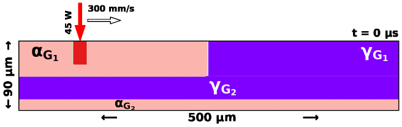

# PhaseField CRAMS : Phase Field - Corrosion Resistant Additive Manufacturing Simulations
## Description of the Repository PhaseField_CRAMS
Primary Austenite (gamma) phase is more resitant to pitting or crevice corrosion as compared to ferrite (alpha) phase. 
Ni is assumed to be an Austenite stabilizer.
This repository consists of the data and codes related to phase field simulations of pseudo binary formulation for Duplex stainless steel to unravel the process-structure relationship in additively manufactured microstructures.
The psudo-binary formulation for multicomponent steel is accomplished usign pyMPEALab toolkit [1].

[1] pyMPEALab App 

The phase field simulations are performed in [MOOSE framework](https://mooseframework.inl.gov/). 
## Phase Field Modeling of Laser Processing
### Phase Evolution | Thermal History

<table>
  <tr>
    <td>
      <strong>High AED condition 5 J/mm²</strong> 
      
    </td>
    <td>
      <strong>High AED condition 5 J/mm²</strong> 
      
    </td>
  </tr>
  <tr>
    <td>
      <strong>High AED condition 1.25 J/mm²</strong> 
      
    </td>
    <td>
      <strong>High AED condition 1.25 J/mm²</strong> 
      
    </td>
  </tr>
</table>

The documentation of PhaseField_CRAMS is made in the work with the following title:

## Integrating experiments and phase field method through informatics  for tailored corrosion performance of additively manufactured steel microstructures.

[Mengistu Dagnaw](https://www.linkedin.com/in/),
[Sachin Poudel](https://www.linkedin.com/in/),
[Upadesh Subedi](https://www.linkedin.com/in/upadesh-s-0b321a15b/),
[Rubi Thapa](https://www.linkedin.com/in/),
[Łukasz Reimann](https://www.linkedin.com/in/),
[Augustine Nana Sekyi Appiah](https://www.linkedin.com/in/),
[Paweł M. Nuckowski](https://www.linkedin.com/in/),
[Mariusz Król](https://www.linkedin.com/in/),
[Zbigniew Brytan](https://www.linkedin.com/in/),
[Nele Moelans](https://www.linkedin.com/in/nele-moelans-57b1731/),
[Anil Kunwar](https://www.linkedin.com/in/anil-kunwar-9ba81653/)

